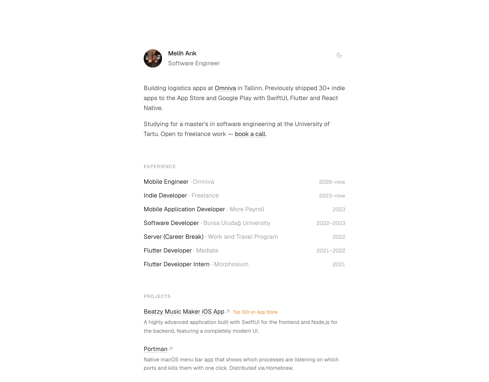

# meliharik.dev

Personal website of [Melih Arık](https://meliharik.dev). A minimal, typography-first portfolio built with Next.js.

<picture>
  <source media="(prefers-color-scheme: dark)" srcset="docs/screenshot-dark.png">
  
</picture>

## Features

- **Minimal, content-first design**: single narrow column, quiet link underlines, subtle staggered entrance animation
- **Light / dark theme**: manual toggle persisted in `localStorage`, defaults to system preference, no flash on load
- **Server-side Medium feed**: latest posts fetched at build time with daily ISR revalidation, no third-party RSS proxy
- **SEO-ready**: Person JSON-LD structured data, Open Graph image generated with `next/og`, sitemap, robots, `llms.txt` for AI crawlers
- **Fully static**: every page prerendered, ~100 kB first-load JS
- **Analytics-optional**: Google Analytics and Microsoft Clarity load only when their env vars are set

## Tech stack

- [Next.js 15](https://nextjs.org) (App Router) + React 19
- [Tailwind CSS](https://tailwindcss.com)
- TypeScript
- Deployed on [Netlify](https://netlify.com)

## Getting started

```bash
npm install
npm run dev
```

Open [http://localhost:3000](http://localhost:3000).

All content lives in typed data files under [`src/lib/data`](src/lib/data). Edit those to make the site yours.

## Environment variables

Optional; copy `.env.example` to `.env.local`:

| Variable | Description |
|----------|-------------|
| `NEXT_PUBLIC_GA_ID` | Google Analytics 4 measurement ID (`G-…`) |
| `NEXT_PUBLIC_CLARITY_ID` | Microsoft Clarity project ID |

The site builds and runs fine without them, analytics scripts are simply omitted.

## Project structure

```
src/
├── app/            # App Router pages, metadata, OG image, sitemap, robots
├── components/     # LocalTime, ThemeToggle
├── lib/data/       # Content: experience, projects, education, talks
└── types/          # Shared TypeScript interfaces
```

## License

[MIT](LICENSE). Feel free to use this as a starting point for your own site. A link back is appreciated but not required.
